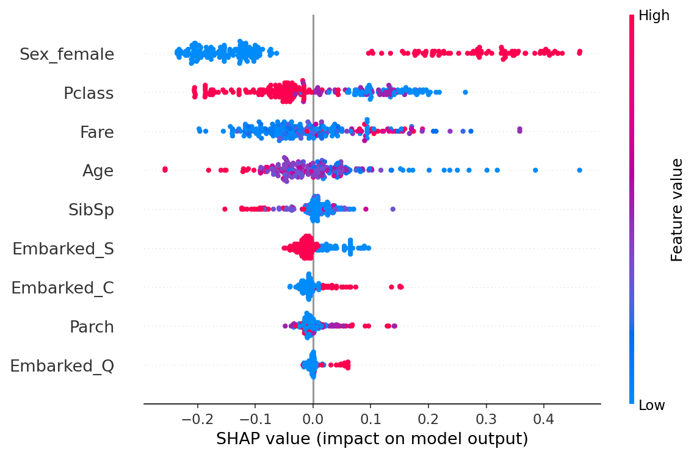

# Explainability Audit — Random Forest su dati Titanic

Simulazione di audit di spiegabilità su un classificatore tabellare, con SHAP e LIME. Il sistema è costruito dall'auditor su dati storici; lo scenario ad alto rischio è ipotetico e serve ad applicare i criteri di trasparenza e spiegabilità dell'AI Act (artt. 13, 14, 86).

| Voce | Dettaglio |
|---|---|
| Engagement ID | AL-AUD-2026-SIMULAZIONE-TITANIC-1-3 |
| Sistema | Random Forest, 200 alberi, 891 passeggeri (Titanic, Kaggle) |
| Tecniche | SHAP globale e locale, LIME su 10 semi, controlli su ipotesi dichiarate prima dell'esecuzione |
| Esito | Non conforme nello scenario ipotizzato ad alto rischio, per un rilievo Major; per il resto conforme con osservazioni |

## Risultati principali

| Voce | Risultato |
|---|---|
| Prestazione | Accuratezza 0,8213 (deviazione standard 0,0243) su 20 divisioni; 0,7489 sulla divisione usata per le spiegazioni |
| Feature dominante | Sesso: |SHAP| medio 0,2024, più del doppio della feature successiva |
| SHAP contro LIME | Concordano sull'essenziale, divergono sulle feature secondarie e sul segno dell'età |
| Rilievi | 1 Major, 2 Minor, 2 Observation |

## Contenuto della cartella

| File | Descrizione |
|---|---|
| Explainability-Audit-Report.pdf | Report tecnico con metodo, risultati e rilievi |
| Evidence-Register.xlsx | Registro delle evidenze (10 voci) |
| Testing-Workpaper.xlsx | Working paper dei test (12 test) |
| Finding-Register.xlsx | Registro dei rilievi (5 voci) |

## Limiti

Simulazione didattica su dati storici, senza cliente reale né soglie di accettazione concordate. Un solo modello e un solo algoritmo; spiegazioni locali su tre casi scelti con regola dichiarata; calibrazione ed equità tra gruppi non misurate in questa tappa.

## Contatti

alittera@gmail.com
